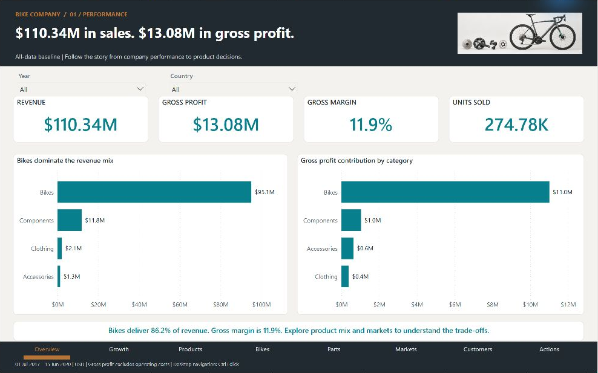
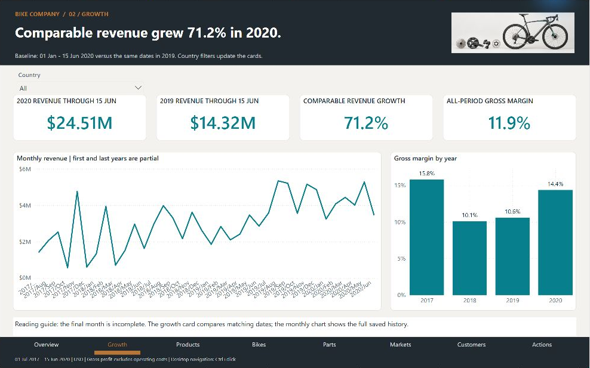
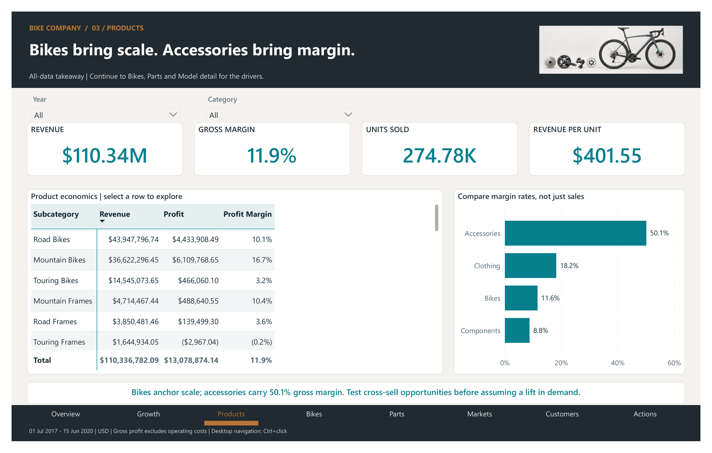
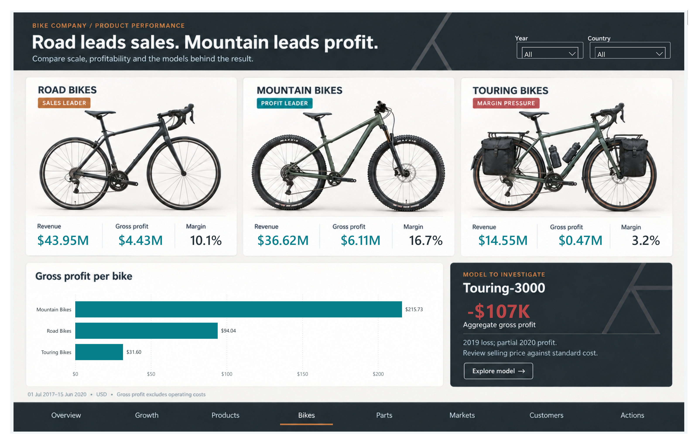
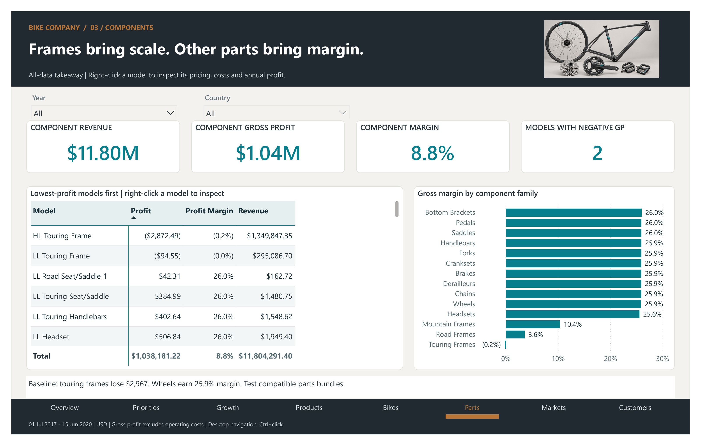
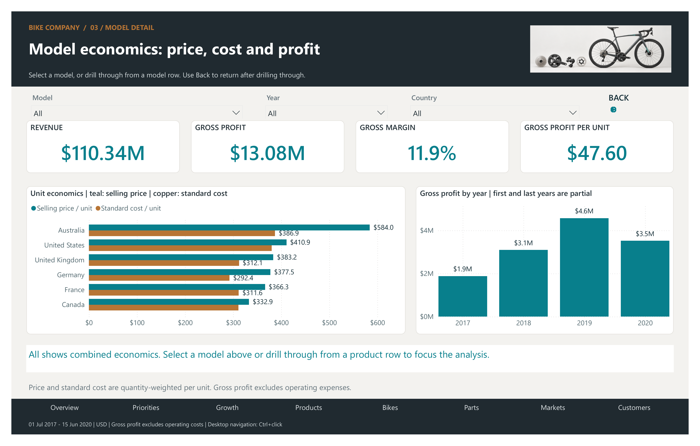
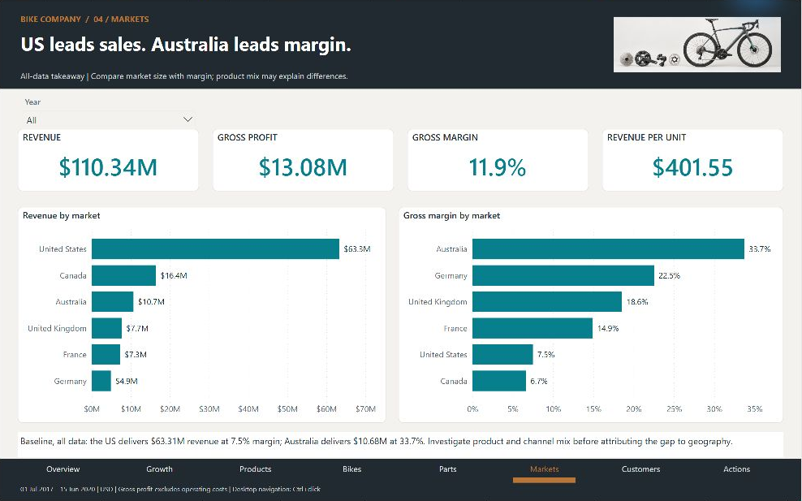
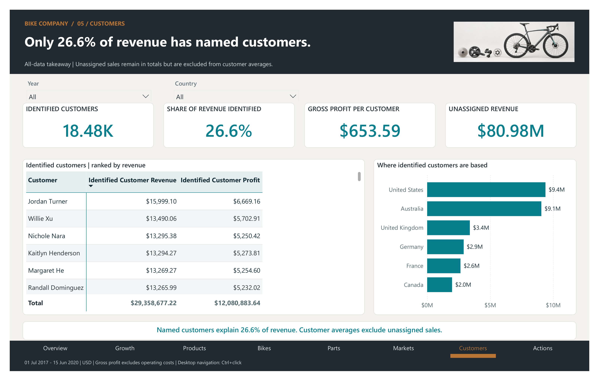
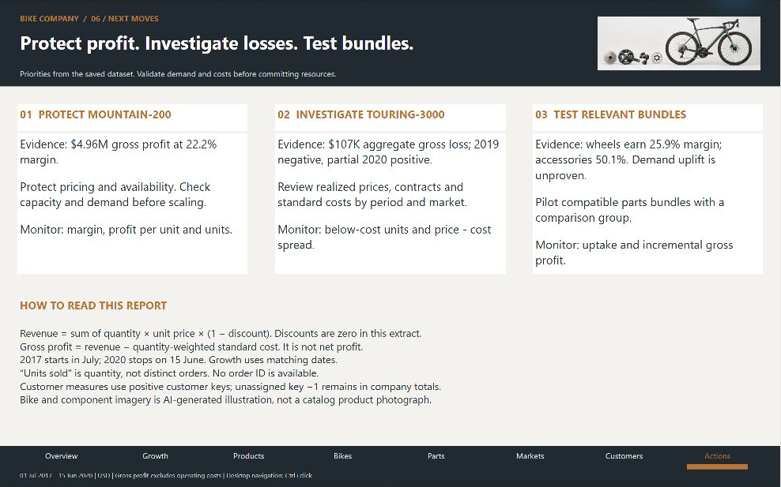

# Bike Company | Sales & Profitability Analytics

A nine-page Power BI report following the story from company performance to bike families, component economics and model-level decisions.

**[Download the Power BI report](Bike%20Company.pbix?raw=true)** · [Browse all screenshots](docs/) · [Reading guide](docs/READING-GUIDE.md)

Start with the company overview: **$110.34M revenue**, **$13.08M gross profit**, and the categories behind those results.

## At a glance

Saved data: **1 July 2017–15 June 2020**. All financial figures are USD.

| Metric | Result |
|---|---:|
| Revenue | $110,336,782.09 |
| Gross profit | $13,078,874.14 |
| Gross margin | 11.85% |
| Units sold | 274,776 |
| Identified customers | 18,484 |

## What the report shows

- **Road leads revenue; mountain leads profit.** Road bikes generate $43.95M revenue. Mountain bikes contribute $6.11M gross profit, with $215.73 profit per unit versus road's $94.04 and touring's $31.60.
- **Mountain-200 is a major profit contributor.** It generates $4.96M gross profit at 22.25% margin. Protect its economics and evaluate demand and capacity before scaling.
- **Touring-3000 needs a time-aware pricing review.** Its aggregate $107,428.96 gross loss reflects a 2019 loss and a positive partial 2020 period. Average selling price of $442.63 is below $461.44 standard cost.
- **Parts create a testable opportunity.** Wheels earn 25.89% margin; touring frames lose $2,967.04. Test relevant bundles without assuming demand uplift.
- **Growth needs matching dates.** Revenue from 1 January–15 June rises from $14.32M in 2019 to $24.51M in 2020, an increase of 71.2%.
- **Customer coverage limits interpretation.** Only 26.6% of revenue is assigned to named customers. Unassigned does not establish a sales channel.

## Explore the report

### Growth

Compare 1 January–15 June in both years: revenue grew 71.2% in 2020. The monthly chart retains the full saved history and its partial first and last years.

### Products

Compare revenue, gross profit and margin across product families. Bikes provide scale while accessories have a higher margin rate.

### Bike comparison

Compare illustrated road, mountain and touring bikes. Road leads revenue; mountain leads gross profit. Compare gross profit per bike and use the Touring-3000 callout to frame a model-level pricing investigation. The callout is a fixed all-data finding; the cards and chart respond to the page filters.

### Components

Inspect low-profit models first, then compare component-family margins. Touring frames lose $2,967 overall, while wheels earn 25.9% margin.

### Product detail

Compare selling price with standard cost by market, then examine annual gross profit. **All** shows combined economics; select a model to narrow the view. Teal represents selling price and copper represents standard cost. The screenshot shows the all-model opening view.

### Markets

The US leads revenue at $63.31M, while Australia has a 33.7% gross margin. Compare scale with margin and investigate product mix before attributing differences to geography.

### Customers

Explore the customers we can identify and the limits of that view. Only 26.6% of revenue is assigned to named customers; unassigned sales remain in company totals.

### Next moves

Turn the evidence into three priorities: protect Mountain-200 profitability, investigate Touring-3000 pricing by period, and test compatible parts bundles. Each recommendation names the evidence, action and measures to monitor.

## Design and interaction

- Graphite headers, copper accents, warm backgrounds and white data cards
- Bike and component illustrations that support the product story
- Page-specific year, country, category and model filters
- Teal selling price versus copper standard cost in Product detail
- Supporting hover metrics and a dedicated model-detail page

## Open and explore

Download **Bike Company.pbix** and open it in Power BI Desktop on Windows. The saved model is included. Use the year and country slicers, or right-click a component model row and choose **Drill through → 03c Product detail**. Use **Ctrl+click** on report navigation buttons in Desktop edit mode. Filters are page-specific; static takeaway headlines describe the all-data baseline. Hover over charts for supporting metrics.

## Metrics and interpretation

Revenue sums quantity × unit price × (1 − discount) at the sales-line level. Gross profit subtracts quantity-weighted standard cost; it excludes operating costs and is not net profit. Discounts are zero in this extract. Units are quantities, not distinct orders; the source lacks an order ID. The first and last years are partial.

The project uses the supplied Bike Company Power BI sample. The saved extract is included for exploration; its original external source connections have not been made portable or refreshed. Open the file without refreshing to reproduce the documented snapshot. Internal reconciliations verify arithmetic, not the accounting validity of historical standard costs. Findings are descriptive, not causal.

Bike and parts imagery is AI-generated category illustration, not a photograph of the named models. See [image provenance](docs/IMAGE-PROVENANCE.md).
